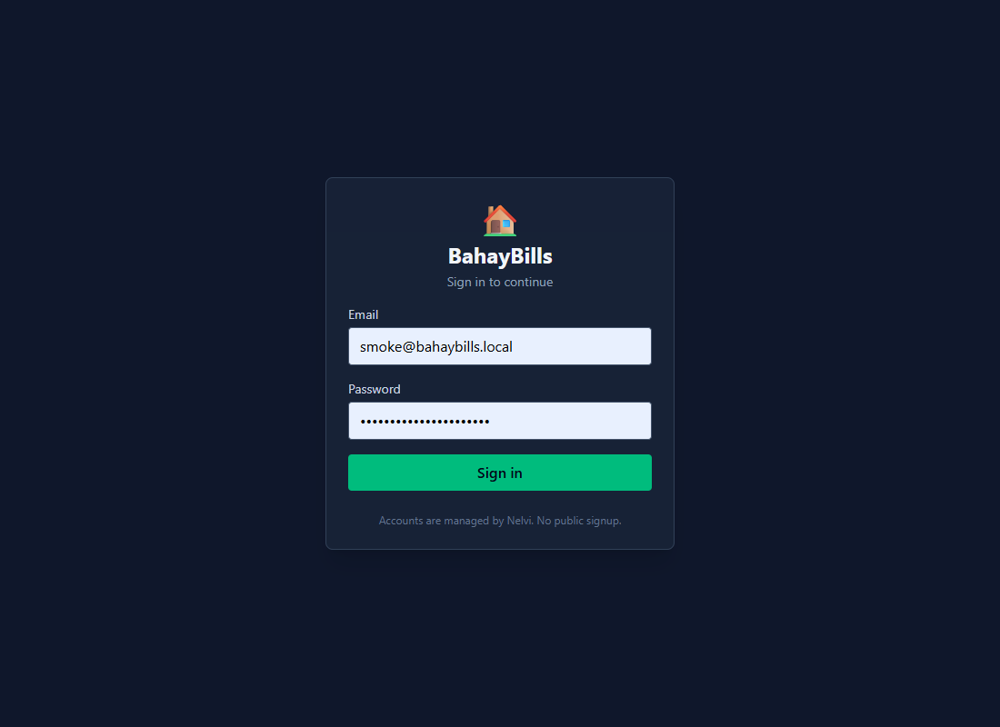
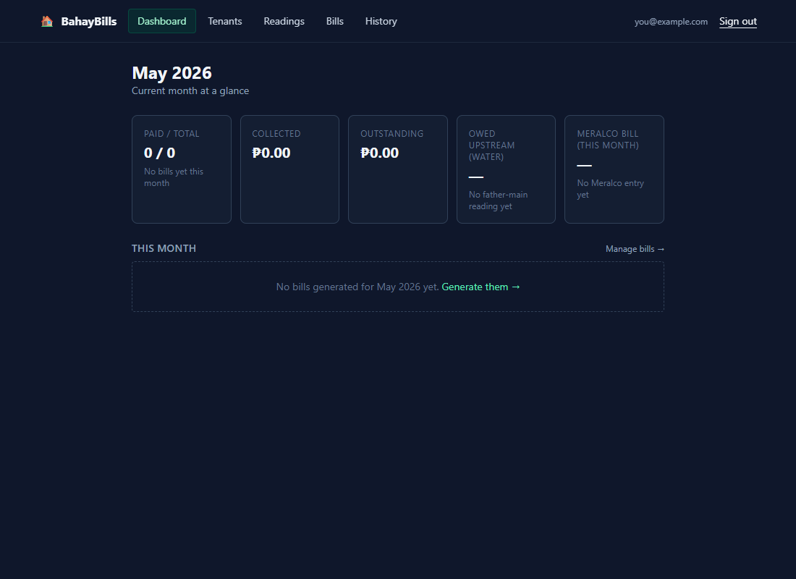
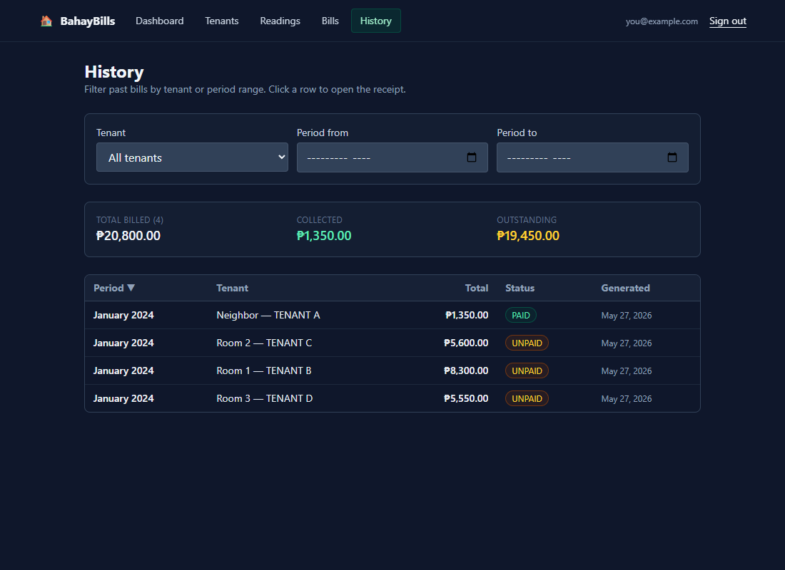
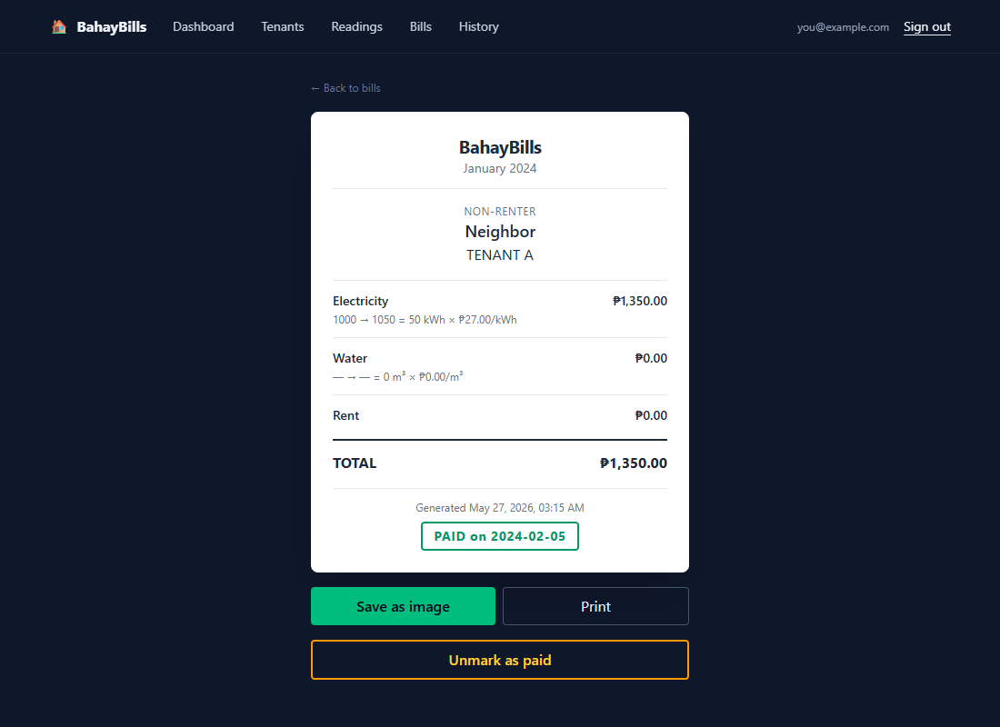
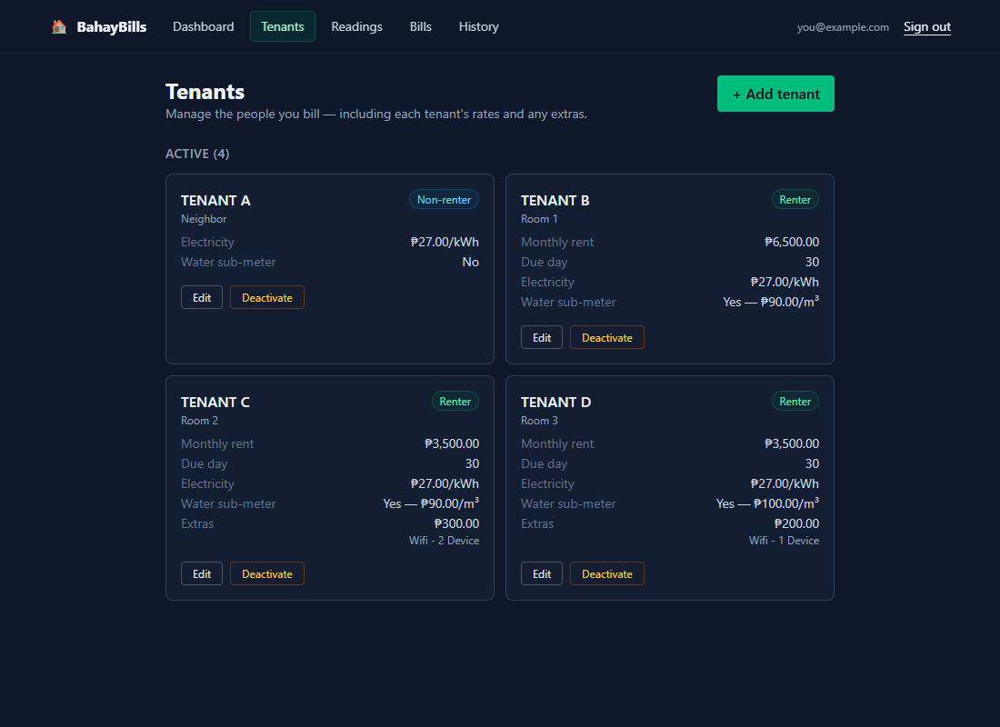
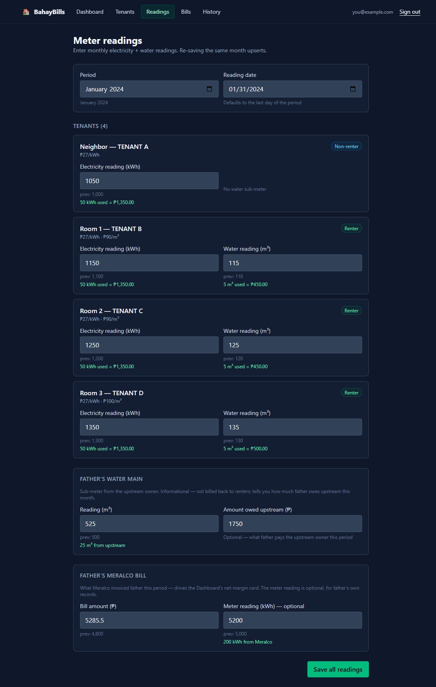
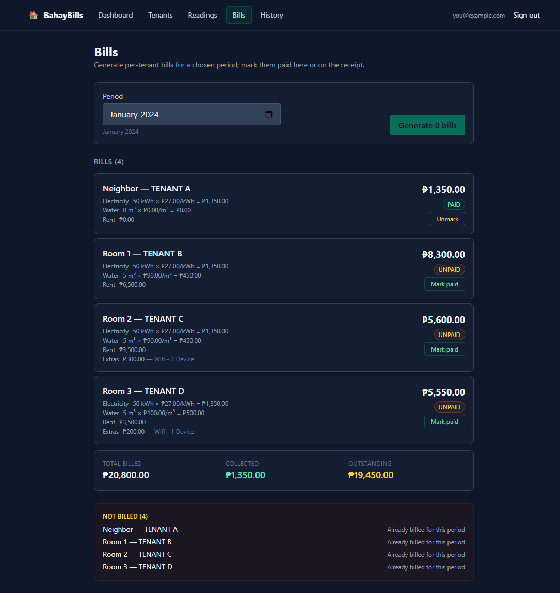

# 🏠 BahayBills — `renters-billing`

A small, free web app that replaces a paper-based monthly billing process for a property in the Philippines with **3 renters** and **1 non-renter** sub-metered for electricity (and water for the renters).

Built so the on-site user (Nelvi) can record meter readings and generate bills, and the remote owner (his father) can view everything from his Android phone — no installs, no fees.

> **Live app:** https://siggven.github.io/renters-billing/
> **Spec:** [`docs/SPEC.md`](./docs/SPEC.md) · **Plan:** [`PLAN.md`](./PLAN.md) · **Operating manual for AI agents:** [`AGENTS.md`](./AGENTS.md)

---

## What it does

- 📊 **Per-tenant bills** — `(curr − prev reading) × tenant rate`, plus rent for renters, plus a single optional extras line (e.g. wifi)
- 🧾 **Mobile-friendly receipts** — clean cards you can save as a PNG and send via Messenger
- 💰 **Payment tracking** — mark each bill paid / unpaid; the receipt's PAID stamp persists in the saved image
- 📚 **History** — every reading and every bill kept in Supabase Postgres, browsable by tenant + date range
- ⚡ **Father's bookkeeping** — track the upstream Meralco bill and water-main usage so the owner can see his net margin per month
- 🔐 **Private** — password-protected; only Nelvi and his father have accounts (no public signup)

## What it does NOT do (by design)

- ❌ No partial payments, no late fees, no automated reminders
- ❌ No automated backup (export CSV from Supabase Studio when desired)
- ❌ No multi-property / multi-landlord support
- ❌ No public signup
- ❌ No native mobile app — this is a web app that works in mobile Chrome

See [`docs/SPEC.md`](./docs/SPEC.md) for the full specification, including the data model and acceptance criteria.

---

## Quick start — Para sa Tatay (Father, on Android) 📱

> **Goal:** check this month's bills, mark payments as they come in, and look up old bills — all from your phone, in under a minute. Walang i-install (nothing to install).

### 1. Open the app and sign in

Open Chrome on your phone, go to **https://siggven.github.io/renters-billing/**, and sign in with the email + password Nelvi gave you.



> 💡 **Tip — para mas mabilis:** add the page to your home screen (Chrome menu → *Add to Home screen*). Next time, just tap the BahayBills icon — para parang app na siya.

### 2. Read the dashboard — "Sa buwang ito"

The Dashboard lands on the current month and gives you the at-a-glance numbers:



The five cards across the top tell you, for **this month**:

| Card | What it means |
| --- | --- |
| **Paid / Total** | how many bills are settled vs total generated |
| **Collected** | total ₱ collected so far this month |
| **Outstanding** | total ₱ still owed by tenants |
| **Owed upstream (water)** | what father owes the upstream water owner this month |
| **Meralco bill (this month)** | what Meralco invoiced father — used to gauge net margin against tenant electricity collected |

Below the cards, each tenant's bill for the current month is listed with **PAID / UNPAID** badges. Tap any card to open the full receipt; tap **Mark paid / Unmark** for a quick payment update without leaving the page.

### 3. Browse old bills — Kasaysayan (History)

Tap **History** in the top nav to see every bill ever generated. Filter by tenant or by date range, sort by any column, and tap a row to open that month's receipt:



### 4. Open and share a receipt

Tap any bill (from the dashboard, the Bills page, or History) to open its receipt:



The receipt shows every line item (electricity prev → curr × rate, water, rent, any extras), the total, the generation timestamp, and a PAID stamp if the bill is settled.

- **Save as image** → downloads a PNG named `<RoomNumber>_<Period>.png` you can attach in Messenger.
- **Print** → prints a paper-friendly version (chrome scale, no app chrome).
- **Unmark as paid** → reverts a paid bill to unpaid (mistake-correction).

> 💡 **Tagalog notes:** *Bayad na* = PAID · *Hindi pa bayad* = UNPAID · *I-save* = save · *Pindutin* = tap.

That's it for the father. The rest of this README is for whoever **records** the readings and **generates** the bills (currently Nelvi).

---

## Monthly flow — for whoever runs the readings

Once a month, on or near the meter-reading day, walk through these five steps. The whole loop takes ~10 minutes once you've done it once.

### 1. Read the meters and add tenants if needed

If a renter has moved in or out, open **Tenants** and add or deactivate them. Each tenant has their own electricity rate, water rate, monthly rent, and optional extras line (e.g. wifi).



### 2. Enter readings

Open **Readings** and pick the period you're recording (defaults to the current month). The form auto-loads each tenant's previous reading and the live consumption preview tells you what the bill will look like before you save.



Three sections:

- **Per tenant** — electricity (kWh) for everyone, water (m³) for renters with a sub-meter.
- **Father's water main** — the upstream owner's reading + the ₱ owed upstream (informational; not billed back to renters).
- **Father's Meralco bill** — what Meralco invoiced father this period. Drives the Dashboard's net-margin card. The meter reading is optional, for father's own records.

Re-saving the same period upserts (replaces the values), so you can always go back and fix a typo.

### 3. Generate the bills

Open **Bills**, confirm the period is correct, and click **Generate N bills**. The app reads each tenant's curr − prev consumption, multiplies by their rate, adds rent + extras, and writes one `bills` row per active tenant.



The totals strip at the bottom shows **Total Billed / Collected / Outstanding** at a glance. The "Not billed" section explains why any tenant was skipped (most commonly: already billed for this period, or no reading recorded yet).

> ℹ️ Bill generation is **idempotent**: clicking Generate again on a period that already has bills won't produce duplicates. If you need to regenerate (e.g. after fixing a reading), delete the affected bill row in Supabase Studio first, then click Generate.

### 4. Send each receipt via Messenger

For each bill, tap the card to open the receipt → **Save as image** → attach the PNG in Messenger to the renter. The image renders cleanly on Android and includes the period, line items, and total.

### 5. Mark paid as money comes in

When a renter pays, open the bill (Dashboard → tap the row, or Bills page → tap the card) and click **Mark paid**. A modal asks for the paid date (defaults to today, Asia/Manila) and an optional note (e.g. "GCash 5pm"). The PAID stamp shows up immediately on the receipt — including in any new screenshot you save.

---

## Tech stack

| Concern | Choice |
| --- | --- |
| Frontend | React 19 + Vite 6 + TypeScript (strict) |
| Styling | Tailwind CSS v4 |
| Routing | React Router v6 |
| Data layer | `@supabase/supabase-js` + TanStack Query v5 |
| Backend | Supabase (Postgres + Auth + Row Level Security) |
| Receipt → image | `html2canvas` (lazy-loaded) |
| Toasts | `sonner` |
| Tests | Vitest + React Testing Library |
| Lint / format | ESLint 9 (flat config) + Prettier |
| Hosting | GitHub Pages, deployed by GitHub Actions on push to `main` |

**Cost:** ₱0/month (Supabase + GitHub Pages free tiers).

---

## Developer setup

### Prerequisites

- Node.js 20+ and `npm`
- A free [Supabase](https://supabase.com/) project (region close to your users — e.g. `ap-southeast-1` Singapore for the Philippines)
- A GitHub repository with Pages enabled (Settings → Pages → Source = "GitHub Actions")

### Get the code running locally

```bash
# 1. Clone and install
git clone https://github.com/<your-username>/renters-billing.git
cd renters-billing
npm install

# 2. Configure Supabase
cp .env.example .env.local
# edit .env.local — fill in:
#   VITE_SUPABASE_URL=https://<project-ref>.supabase.co
#   VITE_SUPABASE_ANON_KEY=<your-publishable-anon-key>

# 3. Apply database migrations via Supabase Studio
#    Open https://supabase.com/dashboard/project/<project-ref>/sql/new
#    Paste each file from supabase/migrations/ in order (0001 → 0002 → 0003)
#    and click Run.

# 4. Create the two auth users
#    Supabase Studio → Authentication → Users → Add user
#    (one for you, one for the property owner). "Auto Confirm" enabled.

# 5. Run dev server
npm run dev
# → http://localhost:5173
```

### Quality gates (must pass before commit/deploy)

```bash
npm run lint         # ESLint
npm run typecheck    # tsc --noEmit
npm run test         # Vitest
npm run build        # Vite production build

# When you change anything in supabase/ (schema, RLS), also run:
npm run smoke        # end-to-end RLS round-trip via a dedicated test user
                     # creds live in .env.test.local (gitignored)
```

The CI workflow at [`.github/workflows/deploy.yml`](./.github/workflows/deploy.yml) enforces the four core gates before deploying. Smoke is **not** in CI by default (it requires credential-bearing secrets); run it locally before pushing database changes.

### Deploy

Push to `main` — GitHub Actions builds and deploys to Pages automatically. Make sure the repo's `VITE_SUPABASE_URL` and `VITE_SUPABASE_ANON_KEY` are set as repo secrets (Settings → Secrets and variables → Actions) so the build picks them up.

### Updating the screenshots in this README

The screenshots in `docs/screenshots/` are captured on the deployed site against seeded sentinel data so the public repo never embeds real tenant names. The two helper scripts that drive the flow:

- `scripts/seed-screenshot-sentinel.mjs` — inserts plausible readings + bills for periods `2023-12` and `2024-01` referencing your existing tenants.
- `scripts/cleanup-screenshot-sentinel.mjs` — deletes everything seeded, leaving the DB exactly as it was.

To refresh: run `node scripts/seed-screenshot-sentinel.mjs`, capture screenshots via Playwright (with DOM-text redaction of real tenant names), then run `node scripts/cleanup-screenshot-sentinel.mjs`.

---

## Project conventions

- Specs and plans live under version control: [`docs/SPEC.md`](./docs/SPEC.md), [`PLAN.md`](./PLAN.md).
- AI agents working on this repo follow [`AGENTS.md`](./AGENTS.md). The reviewer agent is invoked after every task commit.
- Methodology drawn from the user's `aiagents-workflow` Obsidian vault.

## License

Private project — not licensed for redistribution.
